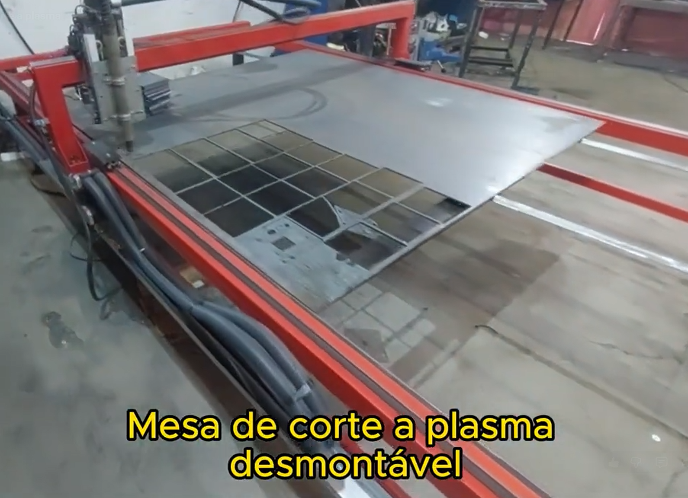
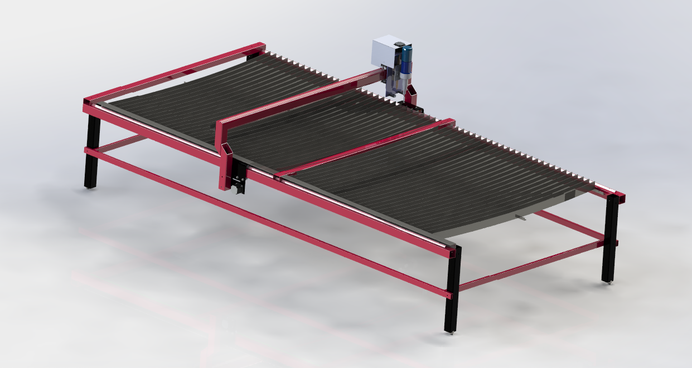
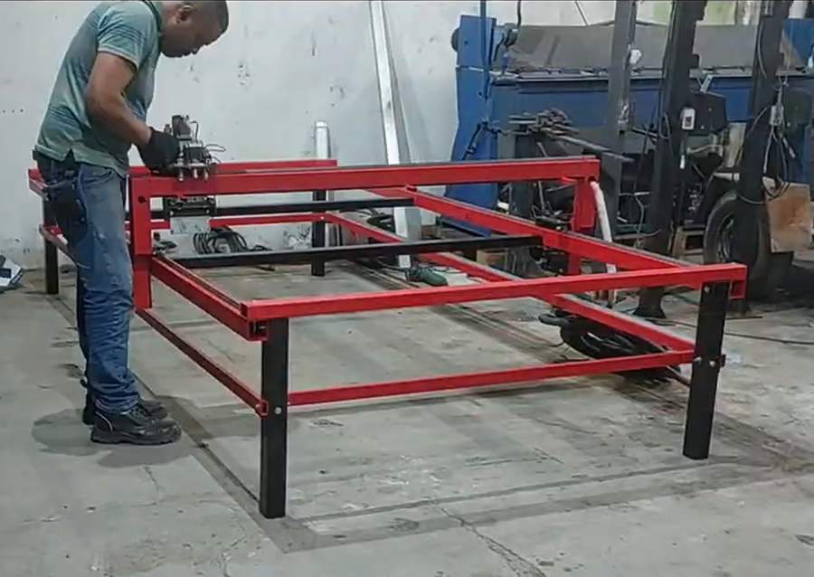
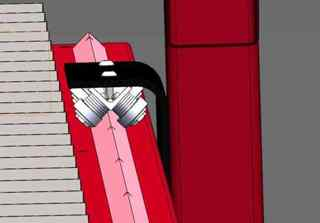
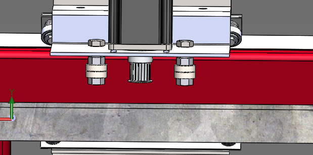
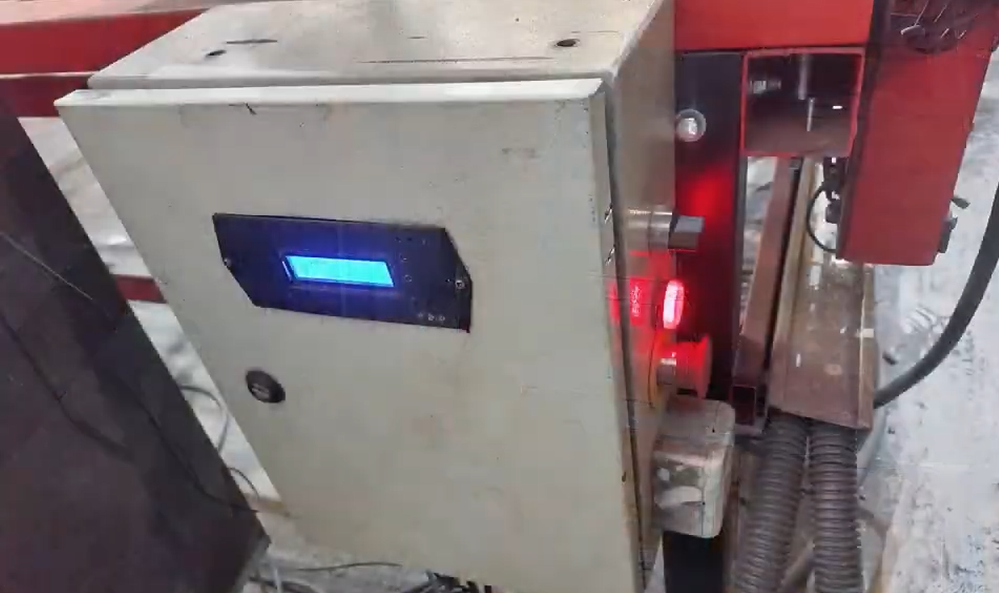
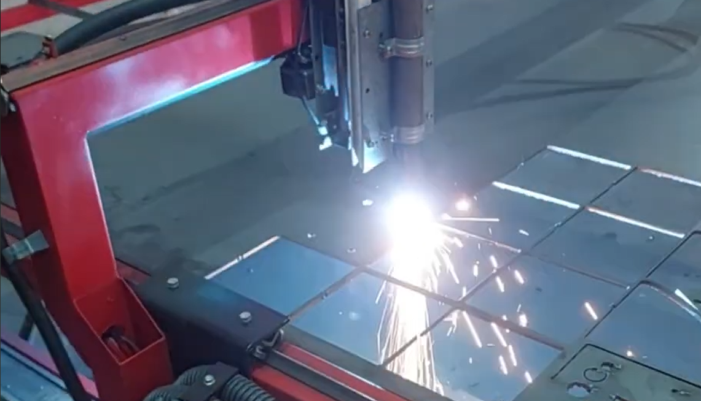

# Mesa de Corte a Plasma CNC

Projeto de uma mesa de corte a plasma desmontável, desenvolvida para o corte de chapas metálicas de grandes dimensões com ótima precisão, baixíssimo custo estrutural e facilidade de transporte/montagem.

O equipamento foi projetado e simulado em computador a partir dos requisitos do cliente **Revlo do Brasil**, com foco em uma estrutura leve, modular e adaptável para diferentes tipos de serviço.

## Visão geral

- **Capacidade de corte**: Chapas de até **1500 mm × 3000 mm × 13 mm**, tubos e peças prontas
- **Tipos de corte**: Todos os tipos - cortes retos, furos, entradas, rasgos e cortes de bordas com **precisão de 0,02 mm**
- **Velocidade máxima**: Até **1500 mm/min** com Mach3 R3
- **Estrutura desmontável**, leve e de fácil remontagem no local de uso
- **Custo total: menos de R$ 10.000** (sem incluir fonte plasma e tocha)
- **Suporta**: Controle via computador/notebook com Mach3 R3 e desenhos processados via SheetCam TNG

## Especificações Técnicas

### Dimensões e Capacidade
- Área de trabalho: **1500 mm × 3000 mm**
- Espessura máxima de chapas: **13 mm**
- Precisão de corte: **±0,02 mm**
- Peso: Muito leve (estrutura modular)

### Desempenho Produtivo
- **Ótima produtividade**: Chapas entre 1 a 4 mm
- **Produtividade limitada**: Chapas acima de 8 mm (requer estratégia de resfriamento)
- **Chapas acima de 8 mm**: 
  - Molhar manualmente a chapa durante o corte, ou
  - Realizar cortes alternados em extremidades opostas para evitar concentração de calor

### Componentes Necessários
- Fonte de plasma (não incluída)
- Tocha **Power Max 35 HYPERTHERM** (não incluída)
- Computador/Notebook para controle
- Software **SheetCam TNG** para gerar esquemas de corte
- Software **Mach3 R3** para gerar G-codes e controlar a máquina

## Estrutura Mecânica

A estrutura utiliza uma solução simples e robusta, com guias construídas a partir de cantoneiras. Essa escolha reduz o custo de fabricação sem abrir mão do alinhamento necessário para obter cortes precisos.

O conjunto foi pensado para ser desmontável. Isso facilita o transporte da máquina e permite que ela seja remontada conforme a necessidade do local de trabalho.

## Grelha e Apoio das Peças

A mesa possui grelha removível, permitindo adaptar o apoio do material de acordo com o tipo de peça. Quando necessário, a grelha pode ser retirada para acomodar peças inteiras ou materiais com formato irregular.

Também foram previstos suportes de encosto para alinhamento dos dois lados da mesa, ajudando no posicionamento das chapas e peças durante o corte.

## Tração e Movimentação

O sistema de movimentação utiliza correias dentadas com alma de aço. Como o conjunto móvel tem baixa inércia, a máquina consegue atingir boas velocidades em deslocamentos sem corte, mantendo a precisão necessária durante os cortes com plasma.

## Aplicações

Este projeto pode ser usado como base para:

- Corte CNC de chapas metálicas de grandes formatos
- Preparação de peças para serralheria e caldeiraria
- Recortes personalizados em aço com alta precisão
- Cortes e furações em tubos
- Cortes de bordas e entradas em peças prontas
- Estudos de estrutura, guias, tração e controle para máquinas CNC de plasma

## Arquivos do Projeto

O repositório contém arquivos de montagem e componentes em formato SolidWorks:

- `Mesa de corte a plasma.SLDASM` - Montagem principal
- `SBR20 Linear Rail 2000 mm v7.SLDASM` - Sistema de trilhos lineares
- `SBR bearing block resizable_SBR20.sldprt` - Bloco de rolamento
- `Peça7.SLDPRT` - Componente estrutural
- `Peça9.SLDPRT` - Componente estrutural
- Pasta `Componentes/` - Componentes adicionais

> **Observação**: Alguns arquivos temporários do SolidWorks (`~$...`) também aparecem no repositório. Eles normalmente são gerados automaticamente durante a edição dos modelos.

## Referência em Vídeo

O funcionamento e as características gerais da máquina foram descritos no vídeo:

[Mesa de corte a plasma - vídeo de referência](https://www.youtube.com/watch?v=QTmyu3U88S4)

Pontos destacados no vídeo:

- Capacidade para chapas de 1500 mm × 3000 mm
- Corte de chapas de até 13 mm
- Precisão de ±0,02 mm em recortes e formatos complexos
- Desenvolvimento simulado em computador
- Estrutura leve, desmontável e modular
- Grelha removível para maior versatilidade
- Guias em cantoneira para reduzir custo mantendo alinhamento
- Tração por correias dentadas com alma de aço
- Conjunto de controle compacto
- Velocidade de corte até 1500 mm/min

## Status

Projeto mecânico em desenvolvimento/testes, com montagem provisória e validações iniciais apresentando bons resultados. **Encomendada e validada pela Revlo do Brasil.**

---

## Contato e Informações

Para mais informações sobre este projeto ou serviços de projetos especiais e produções personalizadas:

📧 **E-mail**: autorobotica.sp@gmail.com  
🌐 **Site**: autorobotica.wordpress.com  
💼 **LinkedIn**: linkedin.com/in/raulstar  
📱 **Instagram**: @raulstar3

**Autorobótica - Projetos e Produções Especiais**  
*Raul Sergio - Eng. em Mecatrônica*

---

**Tags**: #Autorobotica #Engenharia #Raulstar #ProduçõesEspeciais #PlasmaTable #CNC #MáquinasEspecializadas
